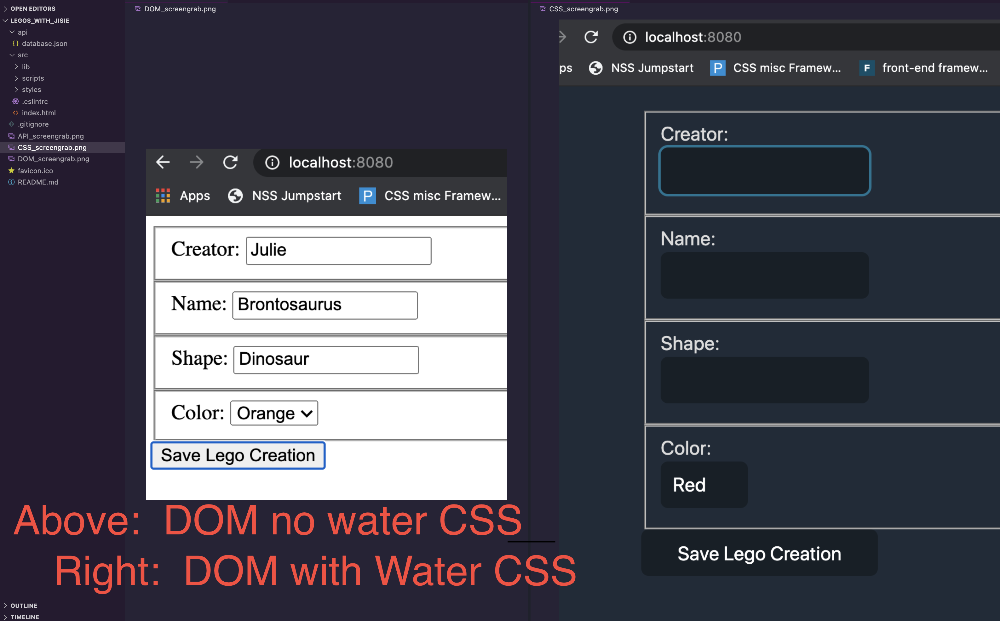

# State Quarters Collector
An app that captures user inputs to create an object; and POSTs that object to an API


# _How to start this project_

## 1. ``` git clone https://github.com/gradyrobbins/state-quarters.git ```
## 2. ``` cd src/lib ```
## 3. ``` grunt   ```
<br/><br/>
## DOM:  ```localhost:8080``` in your browser 

### &nbsp;&nbsp;&nbsp; &nbsp;&nbsp;&nbsp;*NEW FEATURE: Water.css* 🌊 A drop-in collection of [CSS styles](https://watercss.netlify.app/) to make simple websites just a little nicer
<!--  -->
<br/><br/> <br/><br/>
## API:  ```localhost:8088``` in your browser
<!--  -->


## Special Thanks @Jisie David
