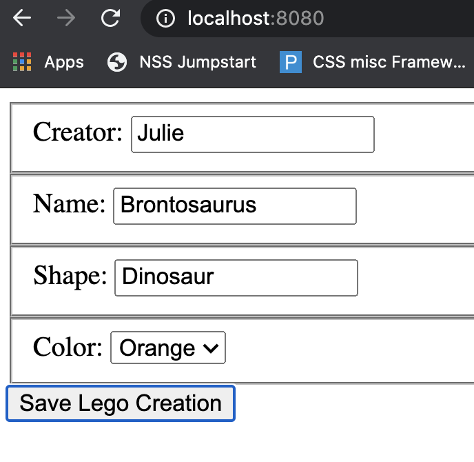
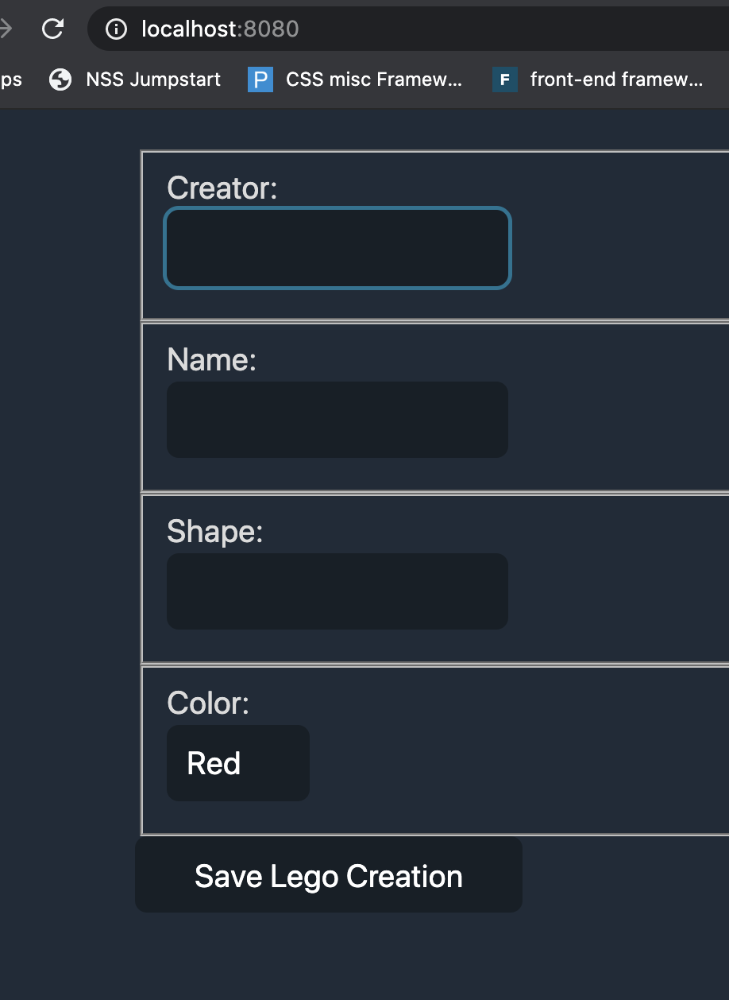

# Lego builder with Jisie

## To run this project:
1. ``` git clone https://github.com/gradyrobbins/legos_with_jisie.git ```
1. ``` cd src/lib ```
1. ``` grunt   ```
1. go to ```localhost:8080``` in your browser


### API:


### DOM:

*NOW Incorporating Water.css*
🌊 A drop-in collection of [CSS styles](https://watercss.netlify.app/) to make simple websites just a little nicer


### DOM (Before using Water CSS):
 <br/><br/>

### DOM (After using Water CSS):



